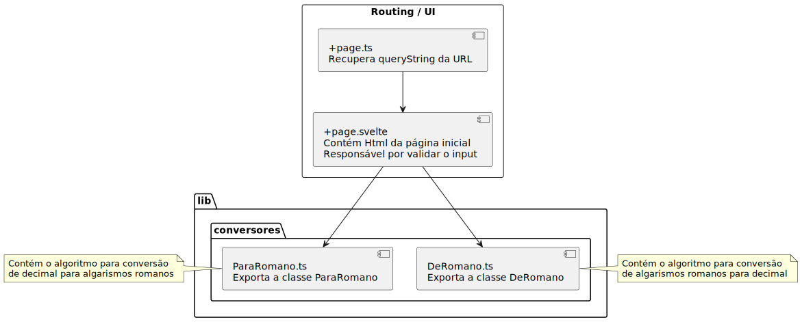

## Estrutura do projeto

- src/routes/+page.svelte 

Contém a página inicial

Responsável também pela validação do input

- src/lib/conversores/DeRomano.ts 

Contém a lógica para converter algarismos romanos para decimal

- src/lib/conversores/ParaRomano.ts 

Contém a lógica para converter valores em decimal para algarismos romanos 

- src/routes/+page.ts

Retorna a QueryString da URL
